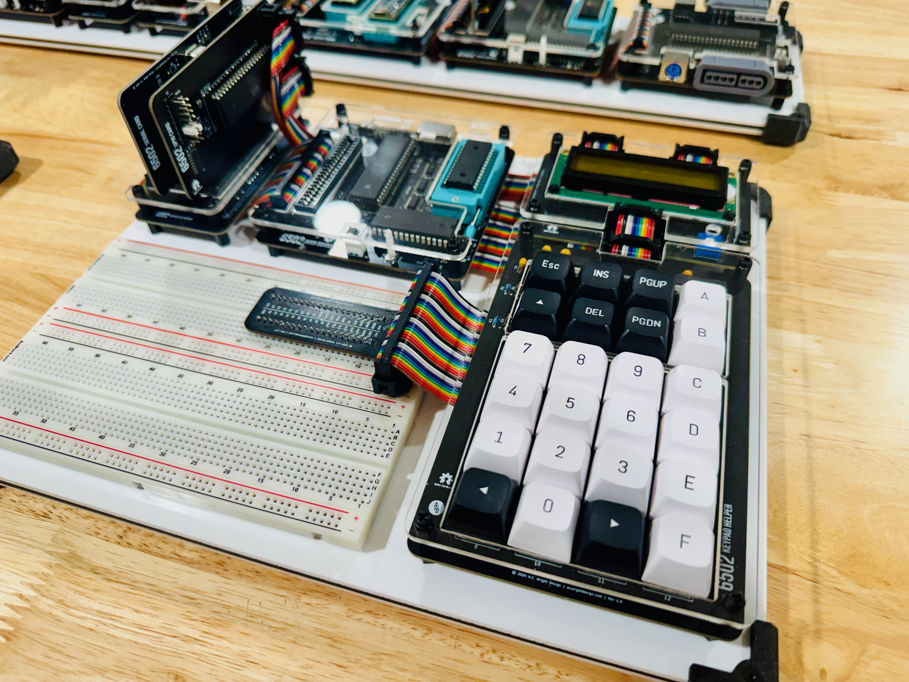

6502-KIM
========

*(Image shows the alternative Main Board configuration — preferred Backplane/Backplane Pro build pictured separately)*

An **AC6502** retro-style 8-bit computer based on the **65C02** microprocessor.

---

## Table of Contents

- [Overview](#overview)
- [Architecture](#architecture)
- [Systems](#systems)
- [Software](#software)
- [Hardware](#hardware)
  - [Backplane / Backplane Pro](#backplane--backplane-pro) *(preferred)*
  - [CPU Card](#cpu-card) *(preferred)*
  - [Memory Card](#memory-card) *(preferred)*
  - [Serial Card](#serial-card)
  - [Backplane Helper](#backplane-helper)
  - [Keypad Card](#keypad-card)
  - [Keypad Helper](#keypad-helper)
  - [Keypad LCD Helper](#keypad-lcd-helper)
  - [Main Board](#main-board) *(alternative)*
- [Firmware](#firmware)
- [CAD](#cad)
- [Production](#production)
- [Schematics](#schematics)
- [Libraries](#libraries)
- [Bill of Materials](#bill-of-materials)
  - [Keypad Card](#keypad-card-1)
  - [Keypad Helper](#keypad-helper-1)
  - [Keypad LCD Helper](#keypad-lcd-helper-1)
- [Purchase](#purchase)
- [License](#license)

## Overview

The AC6502 ecosystem is a family of open-source, 65C02-based computers sharing a common architecture, memory map, and [BIOS](https://github.com/acwright/6502-BIOS). Each computer in the family is purpose-built for a different use case but runs the same software and firmware.

The **KIM** (Keypad Input Monitor) is a complete, self-contained 65C02 computer. The preferred way to build it is using a **[Backplane or Backplane Pro](https://github.com/acwright/6502-COB)**, **[CPU Card](https://github.com/acwright/6502-COB)**, and **[Memory Card](https://github.com/acwright/6502-COB)** from the COB project, along with the **[Serial Card](https://github.com/acwright/6502-COB)** and **[Backplane Helper](https://github.com/acwright/6502-COB)** (also from COB) and the **Keypad Card** — a card that the **Keypad Helper** (keypad matrix) and **Keypad LCD Helper** (16x2 LCD display) attach to. As an alternative, the **[Main Board](https://github.com/acwright/6502-VCS)** from the VCS project can be substituted for the Backplane/CPU/Memory combination.

## Architecture

All AC6502 computers share:

- **CPU**: 65C02 (or accurate emulation)
- **Memory**: 32KB RAM + 32KB ROM, with optional banked RAM expansion
- **Memory Map**: Standardized across the ecosystem — zero page, stack, I/O space ($8000–$9FFF), system ROM, and interrupt vectors at $FFFA–$FFFF
- **Bus**: 16-bit address bus, 8-bit bidirectional data bus, standard 65C02 control signals (RW, PHI2, RESET, IRQ, NMI, RDY, SYNC)
- **BIOS**: A common [BIOS](https://github.com/acwright/6502-BIOS) provides the kernel, monitor, and BASIC interpreter across all systems

## Systems

| Project | Description |
|---------|-------------|
| [6502-ACE](https://github.com/acwright/6502-ACE) | All-in-one Computer Experience — A single board computer |
| [6502-COB](https://github.com/acwright/6502-COB) | Computer On a Backplane — Modular desktop computer with expandable card slots |
| [6502-DEV](https://github.com/acwright/6502-DEV) | Development Environment Vehicle — Emulation-based dev system |
| [6502-KIM](https://github.com/acwright/6502-KIM) | Keypad Input Monitor - KIM-1 inspired minimal computer (YOU ARE HERE) |
| [6502-VCS](https://github.com/acwright/6502-VCS) | Video Computer System — Cartridge-based retro gaming console |

## Software

| Project | Description |
|---------|-------------|
| [6502-BIOS](https://github.com/acwright/6502-BIOS) | The shared BIOS (kernel, monitor, BASIC) for all AC6502 computers |
| [6502-EMULATOR](https://github.com/acwright/6502-EMULATOR) | Emulator for the whole family — desktop app, browser build, and a command line for scripted runs |
| [6502-PRG](https://github.com/acwright/6502-PRG) | Template project for writing assembly language programs |
| [6502-CRT](https://github.com/acwright/6502-CRT) | Template project for writing assembly language cartridges |
| [6502-ASM](https://github.com/acwright/6502-ASM) | Assembly language example programs and demos |
| [6502-BAS](https://github.com/acwright/6502-BAS) | BASIC program listings |
| [6502-WOZMON](https://github.com/acwright/6502-WOZMON) | Wozmon as a standalone ROM |
| [6502-NOP](https://github.com/acwright/6502-NOP) | An all-NOP ROM, for probing a board during bring-up |
| [6502-ASSETS](https://github.com/acwright/6502-ASSETS) | Documentation, branding, schematic exports, and label artwork |
| [cffs](https://github.com/acwright/cffs) | Builds CompactFlash disk images for the BIOS filesystem |
| [bastok](https://github.com/acwright/bastok) | Tokenizes BASIC listings into `.prg` images, and back |
| [bin2woz](https://github.com/acwright/bin2woz) | Converts a binary into a Wozmon serial upload |

## Hardware

This repository contains KiCad 7.0+ PCB designs for the KIM-specific hardware. The KIM also uses boards, cards, and helpers from the [6502-COB](https://github.com/acwright/6502-COB) project, and optionally from the [6502-VCS](https://github.com/acwright/6502-VCS) project.

### Backplane / Backplane Pro
[`Hardware/Backplane/`](https://github.com/acwright/6502-COB/tree/main/Hardware/Backplane) *(6502-COB — preferred)*

Passive backplane providing 5 card slots with full bus interconnect across all slots. The **Backplane Pro** is an enhanced variant with integrated clock generation, reset circuitry, and power distribution.

### CPU Card
[`Hardware/CPU Card/`](https://github.com/acwright/6502-COB/tree/main/Hardware/CPU%20Card) *(6502-COB — preferred)*

Hosts the 65C02 CPU in a card form factor. Plugs into the Backplane or Backplane Pro.

### Memory Card
[`Hardware/Memory Card/`](https://github.com/acwright/6502-COB/tree/main/Hardware/Memory%20Card) *(6502-COB — preferred)*

Provides 32KB SRAM and 32KB EEPROM with address decoding logic. Plugs into the Backplane or Backplane Pro.

### Serial Card
[`Hardware/Serial Card/`](https://github.com/acwright/6502-COB/tree/main/Hardware/Serial%20Card) *(6502-COB)*

RS-232 serial communication via 65C51 ACIA and MAX232 level shifter. Optional — usually fitted, and required for the KC Monitor's serial monitor, but the KIM runs keypad-only without it.

### Backplane Helper
[`Hardware/Backplane Helper/`](https://github.com/acwright/6502-COB/tree/main/Hardware/Backplane%20Helper) *(6502-COB)*

Adds additional card slots to expand the total backplane configuration.

### Main Board
[`Hardware/Main Board/`](https://github.com/acwright/6502-VCS/tree/main/Hardware/Main%20Board) *(6502-VCS — alternative)*

An all-in-one board containing the 65C02 CPU, 32KB SRAM, 32KB EEPROM, clock, and reset circuitry. Can be used in place of the Backplane + CPU Card + Memory Card combination.

### Keypad Card
`Hardware/Keypad Card/`

The card that makes the KIM a KIM. A cartridge card carrying its own ROM and I/O, which the Keypad Helper and Keypad LCD Helper attach to. Provides:

- **PIA**: 65C21 — Port A carries the keypad code (PA0–PA4) and the LCD control lines (PA5 = RS, PA6 = R/W, PA7 = E); Port B is the LCD data bus. CA1 is the keypad data-available interrupt, CA2 the keypad encoder's output enable.
- **ROM**: AT28C64 8KB EEPROM holding the cartridge firmware — see [Firmware](#firmware)
- **Decoding**: two 74HC138 decoders
- **Ports**: PORT A and PORT B headers for the keypad accessories

Unlike every other card in the family, the Keypad Card **overlays the top of the address space**. Its ROM replaces BASIC, the Monitor, Wozmon and the CPU vectors, while the BIOS Kernal at `$A000–$BFFF` stays reachable and is called into by the cartridge:

| Range | Contents |
|-------|----------|
| `$A000–$BFFF` | BIOS Kernal (unchanged, still callable) |
| `$C000–$DFFF` | PIA registers (mirrored I/O window) |
| `$E000–$FFF9` | Cartridge ROM (AT28C64, 8KB) |
| `$FFFA–$FFFF` | CPU vectors (NMI, RESET, IRQ) — the cartridge's own |

This takeover is the reason the KIM behaves differently from every other system in the family, and it is why the KIM is not currently emulated by the [emulator](https://github.com/acwright/6502-EMULATOR) or the [DEV board](https://github.com/acwright/6502-DEV).

### Keypad Helper
`Hardware/Keypad Helper/`

The keypad itself, attaching to the Keypad Card — either directly to PORT A, or through the pass-through header on the Keypad LCD Helper. Provides:

- **Input**: 24 Cherry MX key switches wired as a 4×6 matrix
- **Encoder**: MM74C922 16-key encoder, extended to 24 keys with a 74HC00
- **Output**: 5-bit keycode plus a data-available strobe over a 2×6 PORT header

Scanning, debounce and encoding are all done in hardware. The helper carries no microcontroller and runs no firmware of its own.

### Keypad LCD Helper
`Hardware/Keypad LCD Helper/`

Display companion board that sits between the Keypad Card and the Keypad Helper. Provides:

- **Display**: 16×2 HD44780 LCD with a 10kΩ contrast trimmer, driven from PORT A (RS, R/W, E) and PORT B (8-bit data bus)
- **Pass-through**: a KEYPAD header carrying PA0–PA4, CA1 and CA2 straight through to the Keypad Helper

Like the Keypad Helper, this board carries no microcontroller and runs no firmware — the LCD is driven directly by the Keypad Card's PIA.

## Firmware

`Firmware/KC Monitor/`

The **KC Monitor** is a 6502 assembly language cartridge ROM for the KIM system. It burns to the Keypad Card's AT28C64 and turns the card into a KIM-1-style hex monitor: browse and edit memory and execute code from the 24-key keypad and 16×2 LCD, with a concurrent Wozmon-compatible serial monitor over the Serial Card when one is fitted. See [`Firmware/KC Monitor/README.md`](./Firmware/KC%20Monitor/README.md).

It is the only firmware in this repository — the Keypad Helper and Keypad LCD Helper are hardware-only boards and run no code.

## CAD
`CAD/`

3D-printable enclosure bases and laser-cut top panels for the KIM system.

## Production
`Production/`

JLCPCB-ready Gerber files and BOM/CPL for PCB fabrication and assembly.

## Schematics
`Schematics/`

PDF schematics for all KIM hardware.

## Libraries
`Libraries/`

Shared KiCad symbol and footprint libraries used across all AC6502 hardware projects.

## Bill of Materials

### Keypad Card

| Reference | Qty | Value | Description | LCSC | DigiKey | Mouser | Other |
|-----------|-----|-------|-------------|------|---------|--------|-------|
| C1–C4 | 4 | 100nF | SMD Capacitor 0805 | [C49678](https://www.lcsc.com/search?q=C49678) | | | |
| J2, J3 | 2 | PORT A/B | Box Header 2×6 2.54mm | | [2057-BHR-12-VUA-ND](https://www.digikey.com/en/products/filter?keywords=2057-BHR-12-VUA-ND) | | |
| U1, U2 | 2 | 74HC138 | 3-to-8 Line Decoder | [C5602](https://www.lcsc.com/search?q=C5602) | | | |
| U3 | 1 | 65C21 | Peripheral Interface Adapter | | | [955-W65C21N6TPG-14](https://www.mouser.com/ProductDetail/955-W65C21N6TPG-14) | |
| U4 | 1 | AT28C64 | 8K×8 EEPROM | | [AT28C64B-15PU-ND](https://www.digikey.com/en/products/filter?keywords=AT28C64B-15PU-ND) | [556-AT28C64B15PU](https://www.mouser.com/ProductDetail/556-AT28C64B15PU) | |

### Keypad Helper

| Reference | Qty | Value | Description | DigiKey | Mouser | Other |
|-----------|-----|-------|-------------|---------|--------|-------|
| C1, C2, C4 | 3 | 100nF | Disc Capacitor | [478-5732-ND](https://www.digikey.com/en/products/filter?keywords=478-5732-ND) | | [AMAZON](https://www.amazon.com/PANMILED-Multilayer-Monolithic-Capacitors-Assortment/dp/B0CYQ1Z4G5) |
| C3 | 1 | 1µF | Disc Capacitor | [478-7667-ND](https://www.digikey.com/en/products/filter?keywords=478-7667-ND) | | [AMAZON](https://www.amazon.com/PANMILED-Multilayer-Monolithic-Capacitors-Assortment/dp/B0CYQ1Z4G5) |
| D1, D2 | 2 | 1N914 | Small Signal Diode | [1N914FS-ND](https://www.digikey.com/en/products/filter?keywords=1N914FS-ND) | | |
| J1 | 1 | PORT | Box Header 2×6 2.54mm | [2057-BHR-12-VUA-ND](https://www.digikey.com/en/products/filter?keywords=2057-BHR-12-VUA-ND) | | [AMAZON](https://www.amazon.com/uxcell-2-54mm-2x6-Pin-Straight-Connector/dp/B07DJYVZV2) |
| R1, R2 | 2 | 100kΩ | Resistor | | | [AMAZON](https://www.amazon.com/ALLECIN-8W-Metal-Film-Resistor/dp/B0C77TM3NR) |
| SW1–SW24 | 24 | 0–23 | Cherry MX Switch 1.00u | [CH196-ND](https://www.digikey.com/en/products/filter?keywords=CH196-ND) | | [AMAZON](https://www.amazon.com/dp/B0FYR5TV3X) |
| U1 | 1 | MM74C922 | 16-Key Encoder | | | [AMAZON](https://www.amazon.com/Todiys-74C922N-MM74C922N-Encoder-MM74C922/dp/B08MCJY9LP) |
| U2 | 1 | 74HC00 | Quad 2-Input NAND Gate | [296-1563-5-ND](https://www.digikey.com/en/products/filter?keywords=296-1563-5-ND) | [595-SN74HC00N](https://www.mouser.com/ProductDetail/595-SN74HC00N) | |

### Keypad LCD Helper

| Reference | Qty | Value | Description | DigiKey | Mouser | Other |
|-----------|-----|-------|-------------|---------|--------|-------|
| J1, J2, J3 | 3 | PORT A/B/KEYPAD | Box Header 2×6 2.54mm | [2057-BHR-12-VUA-ND](https://www.digikey.com/en/products/filter?keywords=2057-BHR-12-VUA-ND) | | [AMAZON](https://www.amazon.com/uxcell-2-54mm-2x6-Pin-Straight-Connector/dp/B07DJYVZV2) |
| R1 | 1 | R | Resistor | | | |
| U2 | 1 | LCD-16X2 | 16×2 LCD Display | | | [AMAZON](https://www.amazon.com/MECCANIXITY-Display-Backlight-Interface-Adapter/dp/B0DSFXK7QK) |
| VR1 | 1 | 10kΩ | Potentiometer | [3386F-103LF-ND](https://www.digikey.com/en/products/filter?keywords=3386F-103LF-ND) | | |

## Purchase

I have a few PCBs available on Tindie for those interested in building their own AC6502 system without ordering from a fab directly.

## License

Hardware designs are released under the [CERN Open Hardware Licence Version 2 – Permissive](https://ohwr.org/cern_ohl_p_v2.txt).  
Firmware is released under the [MIT License](./Firmware/KC%20Monitor/LICENSE).
